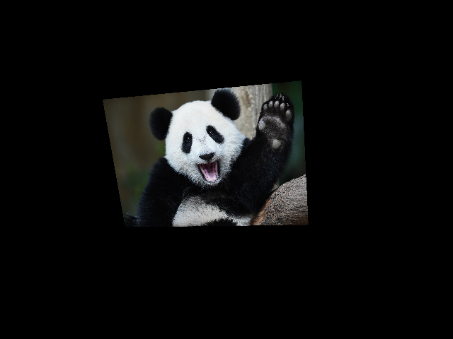
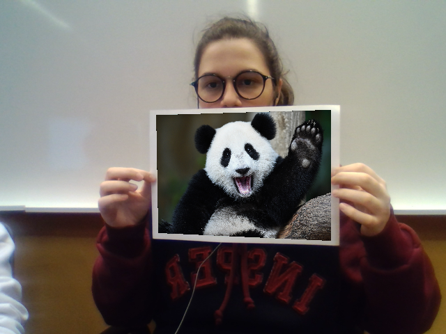
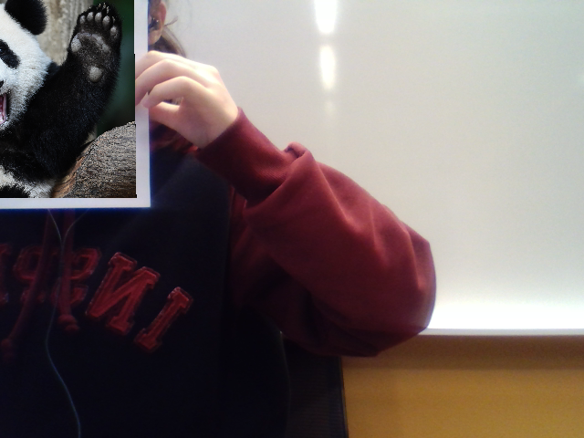
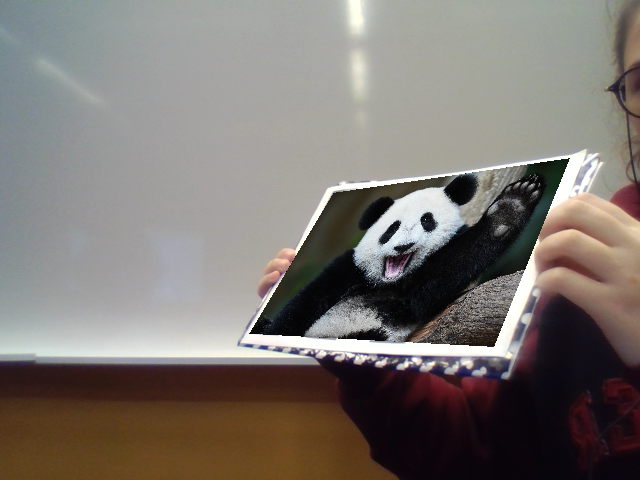

# Projeto 4 - Realidade Aumentada

**Bruna Kimura e Elisa Malzoni**

**Visão Computacional**

----------------------------------------------

## 1. Introdução

Este projeto consiste em construir um programa de realidade aumentada. Para tanto, foi utilizado o Charuco (marcadores) e a webcam do computador. A ideia era um programa que substituísse o local onde o tabuleiro de marcadores está por uma imagem pré selecionada.

## 2. Processamento

### 2.1. Detector de Marcador

O primeiro passo do projeto é entender onde se localiza o tabuleiro de marcadores na imagem da webcam. Para tanto, é necessário descobrir os cantos e ids da imagem do marcador. Essa etapa foi feita utilizando o cv2.aruco.detectMarkers(image, dictionary), função do OpenCV responsável por detectar esse tipo de marcador, retornar seus cantos e ids. O utilizado no projeto foi o cv2.aruco.DICT_6X6_250.

Com os valores do marcador determinado, o segundo passo é abrir a webcam e tentar encontrar o marcador pela imagem da câmera. Para isso, foi utilizada a mesma função acima o detectMarkers do OpenCV. 

### 2.2. Mostrar a imagem

Com o marcador detectado o próximo passo é mostrar uma imagem no plano do tabuleiro. Para tanto, foi utilizado a função do OpenCV cv2.findHomography(srcPoints, dstPoints), que retorna a matriz de transformação,  esta função utiliza os valores dos cantos do tabuleiro original com os achados na imagem da câmera. Para isso, precisa-se dos cantos dos marcadores e seus respectivos ids da imagem do tabuleiro original, para assim serem usados como origem (src) da função findHomography. Porém, quando não há detecção de todos os marcadores, essa correspondência de origem-destino não é feita da forma correta. Dessa forma, somente os cantos originais dos marcadores detectados podem ser usados para tal.

Assim, com a homografia feita, basta aplicar a imagem no plano usando a função cv2.warpPerspective(src, M, dsize), que retorna a imagem já transformada.

## 2.2. Mostrar a Imagem

Com o marcador detectado o próximo passo é mostrar uma imagem no plano do tabuleiro. Para tanto, foi utilizado a função do OpenCV cv2.findHomography(srcPoints, dstPoints), que retorna a matriz de transformação,  esta função utiliza os valores dos cantos do tabuleiro original com os achados na imagem da câmera. Para isso, precisa-se dos cantos dos marcadores e seus respectivos ids da imagem do tabuleiro original, para assim serem usados como origem (src) da função findHomography. Porém, quando não há detecção de todos os marcadores, essa correspondência de origem-destino não é feita da forma correta. Dessa forma, somente os cantos originais dos marcadores detectados podem ser usados para tal.

Assim, com a homografia feita, basta aplicar a imagem no plano usando a função cv2.warpPerspective(src, M, dsize), que retorna a imagem já transformada.

Se somente mostrar a imagem gerada pelo código acima, o resultado é uma imagem completamente preta com apenas a imagem selecionada a mostra, não dando assim, o efeito de realidade aumentada, como mostra a Figura 1. Para contornar essa situação, para cada pixel preto da imagem foi substituído pelo frame original. Um possível problema que poderia ocorrer, é a imagem que será colocada no lugar do tabuleiro ter muitos pixels pretos, nesse caso esses pixels seriam substituídos pelo frame original também, dando um efeito de transparência.

Figura 1 - Imagem sem transparência

Para que a imagem cubra totalmente o tabuleiro é preciso redimensioná-la. Caso a imagem seja menor que o tabuleiro uma parte do tabuleiro ficará a mostra, caso seja maior, a imagem irá substituir uma região maior que o tabuleiro. Para que essa situação não ocorra, basta fazer com que a imagem a ser substituída tenha o mesmo tamanho que o tabuleiro.

## 3. Resultados

Como é possível observar pela Figura 2, o marcador foi substituído perfeitamente pela imagem escolhida, sendo completamente preenchido na imagem.

Figura 2 - Imagem com Realidade Aumentada

O marcador não precisa estar centralizado para que o programa funcione. Mesmo que o marcador esteja na diagonal, ou não esteja completamente mostrado na tela a imagem é substituída de forma satisfatória, como mostra a Figura 3. É necessário que pelo menos um marcador esteja visível para que a imagem seja substituída. 

|    |    |
|----|----|
|||
Figura 3 - Imagens não centralizadas

Quando há menos de um marcador visível pela câmera ou o marcador está muito longe da webcam, o programa não consegue substituir o tabuleiro pela imagem.

## 4. Conclusão

O programa se mostrou bastante eficiente em substituir o tabuleiro por uma imagem, apesar de alguns problemas como, por exemplo, quando a imagem possui muitos pixels pretos. A maior dificuldade encontrada foi conseguir transformar os resultados das funções no formato utilizado para os cálculos.
	
Uma futura melhoria além de pensar em um novo algoritmo para o problema citado acima, seria ao invés de plotar apenas uma imagem no local do tabuleiro, substituir por um objeto 3D, dando assim, uma melhor impressão de realidade aumentada.
